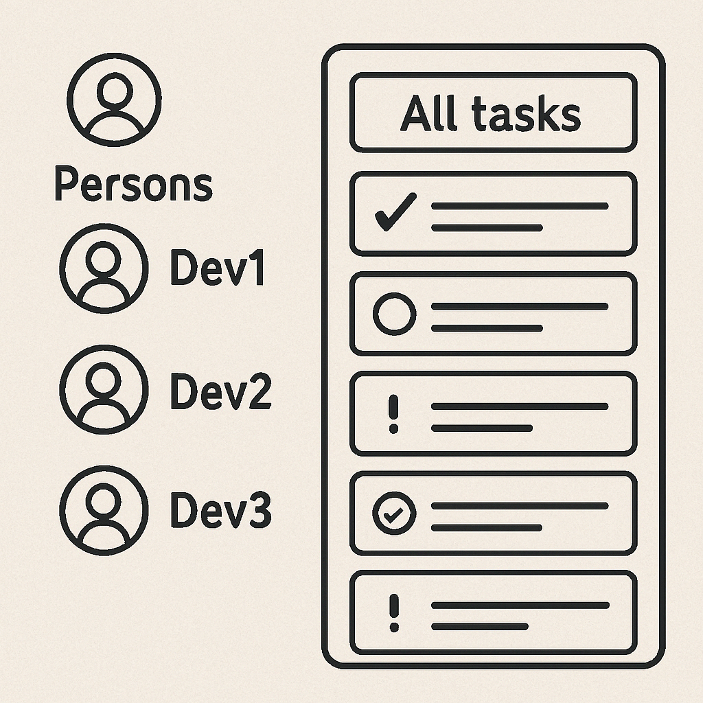

# ✅ Todo API



## 🚀 Getting Started

### 📋 Prerequisites

Make sure the following are installed:

- Java JDK 21
- Maven
- MySQL Database
- Git
- Docker (optional, for containerized deployment)

---

### 🛠️ Setup Instructions

#### 1. Clone the Repositories

```bash
# Clone the main application
git clone https://github.com/mehrdad-javan/todo-api.git
cd todo-api

# Clone the utility library
git clone https://github.com/mehrdad-javan/notify-util-spring.git  
cd notify-util-spring
```

### 3. Set the Environment Variables

```bash
APP_USER_EMAIL=your_email@example.com
APP_USER_PASSWORD=your_password
```

### ▶️ Running the Application

#### 👤 User Credentials

##### 🔐 Admin User

- **Username:** `admin`
- **Password:** `password`
- **Role:** `ADMIN`
- **Email:** `admin@test.se`

##### 👥 Regular User

- **Username:** `user1`
- **Password:** `password`
- **Role:** `USER`
- **Email:** `user1@test.se`

### 🐳 Docker Deployment

#### 1️⃣ Install Docker

1. Download Docker Desktop from [Docker's official website](https://www.docker.com/products/docker-desktop)
2. Install Docker Desktop following the installation guide for your operating system
3. Verify installation:

```bash
docker --version
docker-compose --version
```

#### 2️⃣ Run Using Docker Manually

```bash
# Create a network
docker network create todo-net

# Start MySQL container
docker run --name mysql-db --network todo-net \
  -e MYSQL_ROOT_PASSWORD=root \
  -p 3307:3306 \
  -v mysql_data:/var/lib/mysql \
  -d mysql:8.0

# Build the todo-api Docker image
docker build -t todo-api .

# Run the todo-api container
docker run --name todo-api --network todo-net \
  -p 9090:9090 \
  -e SPRING_PROFILES_ACTIVE=dev-doc \
  -e APP_USER_EMAIL=your-email@gmail.com \
  -e APP_USER_PASSWORD=your-api-password \
  todo-api
```

#### 3️⃣ Run Using Docker Compose

```bash
docker-compose up --build
```

## 🐳 Common Docker Commands

| Action                          | Command                                       |
|---------------------------------|-----------------------------------------------|
| Check Docker version            | `docker --version`                            |
| List all containers             | `docker ps -a`                                |
| Start a container               | `docker start <container_id or name>`         |
| Stop a container                | `docker stop <container_id or name>`          |
| Remove a container              | `docker rm <container_id or name>`            |
| List all images                 | `docker images`                               |
| Remove an image                 | `docker rmi <image_id or name>`               |
| Build an image from Dockerfile  | `docker build -t <image_name> .`              |
| Run a container from image      | `docker run -p 8080:8080 <image_name>`        |
| View container logs             | `docker logs <container_id or name>`          |
| Open shell in running container | `docker exec -it <container_id or name> bash` |
| Remove all stopped containers   | `docker container prune`                      |
| Remove all unused images        | `docker image prune -a`                       |
| Remove all volumes              | `docker volume prune`                         |

---

## 🧰 Common Docker Compose Commands

| Action              | Command                                   |
|---------------------|-------------------------------------------|
| Start services      | `docker-compose up`                       |
| Rebuild and start   | `docker-compose up --build`               |
| Start in background | `docker-compose up -d`                    |
| Stop services       | `docker-compose down`                     |
| View logs           | `docker-compose logs -f`                  |
| List containers     | `docker-compose ps`                       |
| Run one-off command | `docker-compose run <service> <command>`  |
| Rebuild only        | `docker-compose build`                    |
| Remove volumes      | `docker volume rm $(docker volume ls -q)` |
